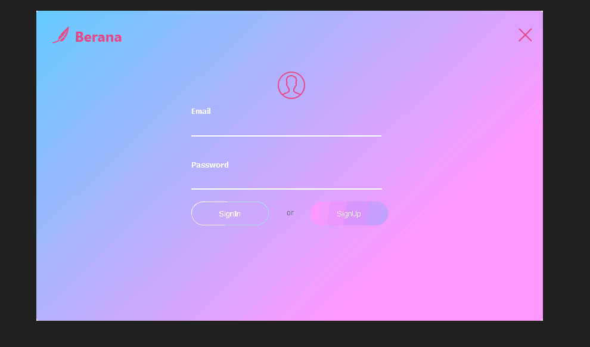

# Berana

Berana is an education focused social media program where users can create text-based posts and follow other users.



## Getting Started

These instructions will get you a copy of the project up and running on your local machine.

### Prerequisites

- [Java](https://www.java.com/en/)
- [IDE (Net Beans)](https://netbeans.apache.org/download/index.html)
- [Microsoft SQL Server](https://www.microsoft.com/en-us/sql-server/sql-server-downloads)

## Usage

1. Clone the repository
1. Create a SQL server database named BeranaUsers, and the sql tables by executing the queries found in
   `./Database.sql`
1. Start Apache NetBeans IDE.
1. On the menu bar, choose File -> Open Project.
1. Specify location of the project.
1. Modify the **username** and **password** values found in `./src/berana/Conndb.java` to the username and password of your SQL Server
1. Click the Run button or press F6 key to execute the project.

### Modifying the username and password values

```java
Class.forName("com.microsoft.sqlserver.jdbc.SQLServerDriver");
        String url = "jdbc:sqlserver://localhost:1433;databasename=BeranaUsers";
        Connection connectDb = DriverManager.getConnection(url,"username","password");
```

## Authors

- **Liul Alemayehu** - _Initial work_
